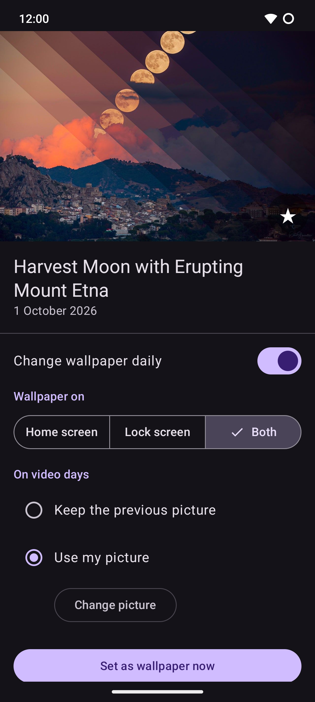

# APODroid

An Android app that sets NASA's [Astronomy Picture of the Day](https://science.nasa.gov/apod/)
(APOD) as your wallpaper, once a day, on its own.



## What it does

One page: today's picture with its title and date, and the settings below it.

- **Change wallpaper daily:** a background job checks for the new picture every few hours, only
  with a network, and sets it once it's out (about 04:05 UTC).
- **Where:** home screen, lock screen, or both.
- **Video days:** keep the previous wallpaper, or use a picture of your own.
- **Set as wallpaper now.**
- Tap the picture to open it on NASA's website; tap the star to save it to your gallery
  (`Pictures/APODroid/`).

## Install

Download the APK from [Releases](https://github.com/buerlino/APODroid/releases), or add
`https://github.com/buerlino/APODroid` to [Obtainium](https://github.com/ImranR98/Obtainium) to
get updates. Android 10 or newer.

## Where the pictures come from

The official APOD API (`api.nasa.gov/planetary/apod`) currently returns the NASA logo instead of
the picture: APOD moved to science.nasa.gov and the API wasn't updated. APODroid reads the
newest APOD post from science.nasa.gov's public WordPress API instead. It isn't a documented API
and may change; if it does, the app leaves your wallpaper alone.

## Privacy

No account, no ads, no tracking. The app talks only to science.nasa.gov. Permissions:
`INTERNET`, `SET_WALLPAPER`, and `ACCESS_NETWORK_STATE` and `RECEIVE_BOOT_COMPLETED` for the
daily job.

## Build

Native Android, Kotlin + Jetpack Compose. Needs the Android SDK; Gradle runs on JDK 21.

```
./gradlew :core:test :app:assembleRelease
```

## License

GPLv3, see [LICENSE](LICENSE). APODroid is not made by or affiliated with NASA.
